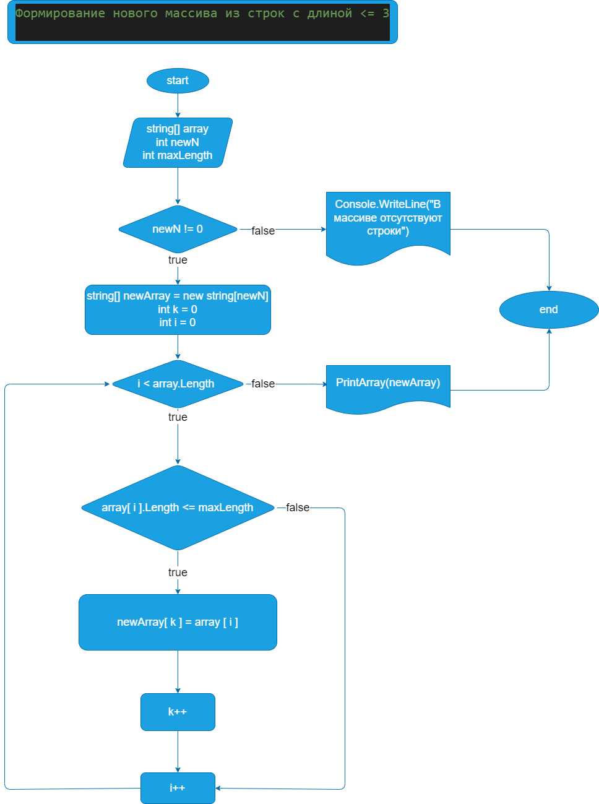

# finaltask
Написать программу, которая из имеющегося массива строк формирует новый массив из строк, длина которых меньше, либо равна 3 символам. Первоначальный массив можно ввести с клавиатуры, либо задать на старте выполнения алгоритма. При решении не рекомендуется пользоваться коллекциями, лучше обойтись исключительно массивами.

Были выполнены следующие этапы решения данной задачи:
1. Ввод количества строк
2. Создание массива строк
3. Ввод строк в массив
4. Печать массива
5. Ввод максимальной длины строк в новом массиве
6. Поиск количества строк с длиной не больше максимального значения
7. Создание и заполнение нового массив

| [Программа](task/Program.cs) |

*Блок-схема 7 метода:*

| [Блок-схема 7 метода](task/diagrams.drawio) |

